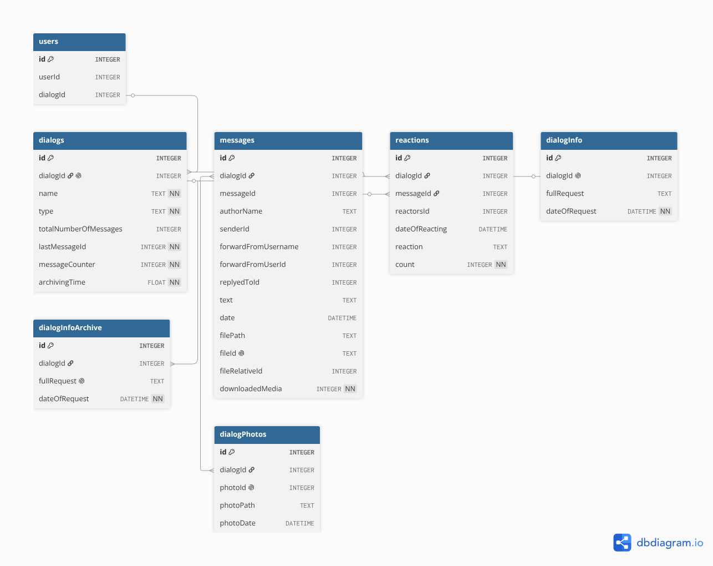

# Telegram Archiver Using Telethon
## The things it archives

It archives:    


## How To Use It

License: MIT  
Author: Eyad Jawad

### WARNING:

DO NOT RUN THIS PROGRAM AGRESSIVELY!  
I haven't tried running the program for extended periods of time, but if you run it for say, days, you might be rate limited multiple times, even though the program handles rate limit, too much rate limit might very well get your account banned, so I'd suggest you be careful when using it for large dialogs.  

#### Update: 
I have used it to archive ~1 Million messages in less than 4 hours, and didn't get banned or rate limited at all, but I aimed for text messages only, still, it is good to be careful and monitor the terminal when planning to use for an extened periods of time, and better yet use it in sessions, not all at once.  

### Setting The API keys

You have to get the API keys from [telegram](https://my.telegram.org) and then set them in the .env:  

```

TELEGRAM_API_KEY = "123456"
TELEGRAM_API_HASH = "abcdefg" 

```
This is probably the safest way possible to ensure that your keys don't get leaked, I would never put mine straight into the program, you could read them from a file, but don't forget to add it to the gitignore.

### Requirements
You only need to install Telethon, and Pytest if you want to test:  

```

pip install -r requirements.txt # If you are a normal user
pip install -r requirementsDev.txt # If you are a dev

```

### Arguments
`-a`, `--archive-all`: `archive everything`  
`-t`, `--archive-text`: `archive text messages (including forward, reply, edit, and sender_id)`  
`-r`, `--archive-reactions`: `archive message reactions`  
`-d`, `--archive-dialog-info`: `archive dialog info like title, bio, pfps, and etc.`  
`-u`, `--archive-user-info`: `archive info of users in a dialog, like name, bio, pfps, and etc.`  
`-f`, `--archive-file`: `archive files, like photos, videos, documents, and etc. with a size threshold (default: 100MB)`  
`-b`, `--archive-big-files`: `archive all files ignoring the default of 100MB`  
`-s`, `--size-threshold` : `the size threshold for files (default: 100MB)`    
After that, you just have to run the command:  

```

python main.py -t -r -f -s 10

```

## Tests

There are tests covering all of the helper module, and some classe, the coverage as reported by `coverage` is `85%`, to run the tests run:  

```

python -m pytest

```

### What Did I Learn

I learnt a lot about file managment, and how to parse things in general, but the coolest thing if you ask me is the progress bar, that is cool.  
This project did take a good chunk of time to finish, or at least get it to work, and I did it mainly because I love archiving things locally, it works pretty well in my opinion.  
I also learnt a good amount of error handling, while it is not sublime, error handling is good here.  
I'd like to add a way to reverse the process and get a GUI out of it, I've seen that on discord archivers, I'd also want to add a way to compress stuff, like files, or at least do something about them because they take A LOT of space.  
All in all, I'm pretty much satisfied with this project, it took me about 50h? idk (probably 70h+ by now (prolly 100h by now)), but I do feel like I'm missing some features.  
I have listed a good list of todos and fixme in the code, I might do them one day...? idk, I hopne it'll be good, inshallah.  
Update: I did get a good hand-on exp. on SQLite and pytest (:
Thank you for reading -Eyad.